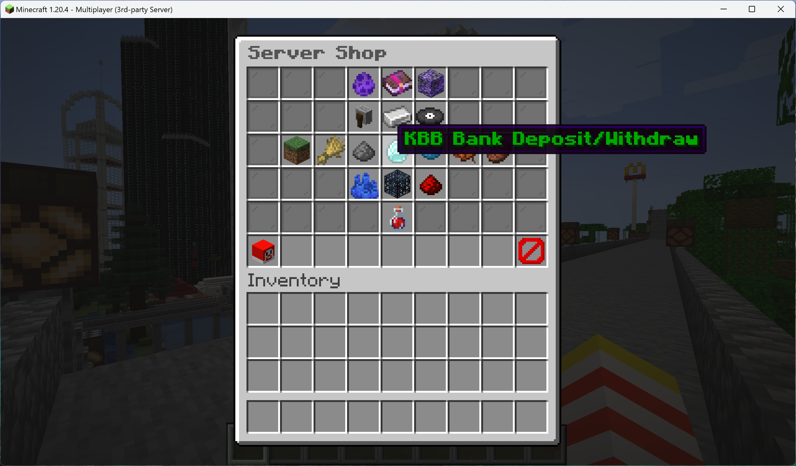
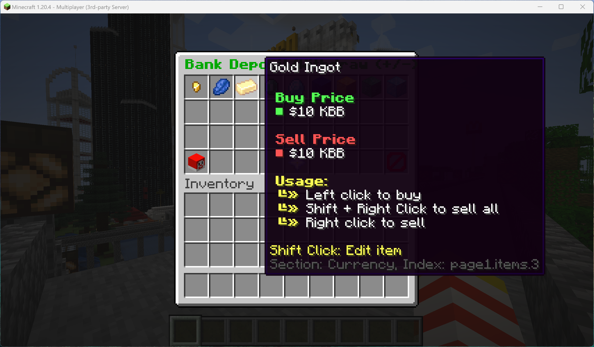
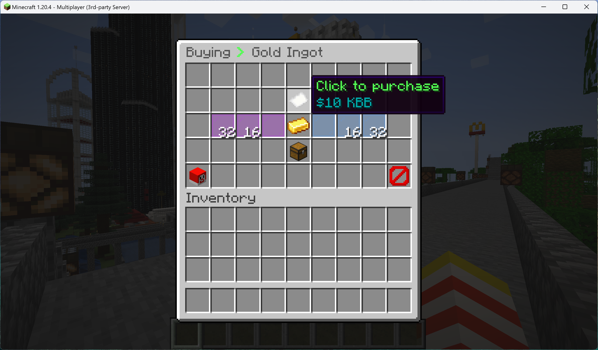

# 🛍️ EconomyShopGUI

### Accessing the Shop or Bank

Can be used for Buying or Selling items, or Depositing or Withdrawing [currency](../rules-and-regulations/kbb-currency-exchange-system.md).

* Enter command `/shop` in console
*   Click your desired product category. Banking will be in the center.&#x20;

    <figure><figcaption></figcaption></figure>
*   Choose the item you with to buy/sell or deposit/withdraw. **Left Click to Buy/Withdraw, Right Click to Sell/Deposit**

    <figure><figcaption></figcaption></figure>
*   Use the page to buy a single item, or specify your desired quantity

    <figure><figcaption></figcaption></figure>
* Items purchased will be added to your inventory, while items sold will be removed in exchange for a specified amount deposited to your bank account.


_All transactions are recorded in Discord, as well as stored in a MySQL database for auditing purposes._

