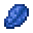

# 💴 KBB Currency Exchange System

### Currency Exchange Rates

Below are the physical currency rates and values. These do not change, but the cost of goods and services may and will be a building block upon having a stable and failproof currency system.&#x20;

<div>

<figure><figcaption><p>Gold Nugget</p></figcaption></figure>

 

<figure><figcaption><p>Lapis Lazuli</p></figcaption></figure>

 

<figure><figcaption><p>Gold Ingot</p></figcaption></figure>

 

<figure><figcaption><p>Emerald</p></figcaption></figure>

 

<figure><figcaption><p>Diamond</p></figcaption></figure>

 

<figure><figcaption><p>Lapis Block</p></figcaption></figure>

 

<figure><figcaption><p>Gold Block</p></figcaption></figure>

 

<figure><figcaption><p>Emerald Block</p></figcaption></figure>

 

<figure><figcaption><p>Diamond Block</p></figcaption></figure>

</div>

<table><thead><tr><th width="181" align="right">Currency</th><th align="center">Single Value</th><th align="center">x64 Value</th></tr></thead><tbody><tr><td align="right">1 Gold Nugget</td><td align="center">$1 KBB</td><td align="center">$64 KBB</td></tr><tr><td align="right">1 Lapis Lazuli</td><td align="center">$5 KBB</td><td align="center">$320 KBB</td></tr><tr><td align="right"><a data-footnote-ref href="#user-content-fn-1">1 Gold Ingot</a></td><td align="center">$10 KBB</td><td align="center">$640 KBB</td></tr><tr><td align="right">1 Emerald</td><td align="center">$25 KBB</td><td align="center">$1,600 KBB</td></tr><tr><td align="right">1 Diamond</td><td align="center">$100 KBB</td><td align="center">$6,400 KBB</td></tr><tr><td align="right"><a data-footnote-ref href="#user-content-fn-2">1 Lapis Block</a></td><td align="center">$45 KBB</td><td align="center">$2,880 KBB</td></tr><tr><td align="right"><a data-footnote-ref href="#user-content-fn-3">1 Gold Block</a></td><td align="center">$90 KBB</td><td align="center">$5,760 KBB</td></tr><tr><td align="right"><a data-footnote-ref href="#user-content-fn-4">1 Emerald Block</a></td><td align="center">$225 KBB</td><td align="center">$14,400 KBB</td></tr><tr><td align="right"><a data-footnote-ref href="#user-content-fn-5">1 Diamond Block</a></td><td align="center">$900 KBB</td><td align="center">$57,600 KBB</td></tr></tbody></table>


Currency will be rounded to the nearest _whole number_. Fractional amounts of 50¢ or less will be rounded down, 51¢ or greater will be rounded up, unless interest is earned. Interest will be calculated to the nearest decimal.&#x20;

Currency will be displayed as [<mark style="color:green;">$2,000,000 KBB</mark>](#user-content-fn-6)[^6]

**KBB** stands for **Koflum Bureau Bucks**


### Banking System

A banking system will be in use to deposit and store your currency. In game physical currency can be deposited or withdrawn. Advantages of storing currency in the bank will protect your assets from theft, allow for easier trade/exchange, allow for earning of interest, ability to take out loans, and buy/sell products. In addition, utilizing the banking system will allow for transparency between fellow counties and could quickly identify foul play.&#x20;

### Participating Countries

* Barrenwood

### Details

<details>

<summary><strong>Regulatory</strong></summary>

#### Central Bank Oversight

Barrenwood will be a central authority responsible for overseeing the entire currency system. Additionally, all countries will have full access to currency transaction records and can report any suspected foul play of a country. Complaints will be taken seriously and will result in an unbiased investigation conducted by the Koflum Data Bureau and potential members of the jury to determine the party at fault. Conviction outcomes can be levied by currency/product/land confiscation or fines determined at ruling.&#x20;

#### Licensing Requirements

All countries wishing to utilize the KBB Currency Exchange System will be required to obtain a license for trade, in addition to electing a public official for representation of said countries transactions, record keeping, and production.

#### Anti-Money Laundering Regulations

Money laundering will be strictly prohibited and any convictions may result to serious disciplinary action to be determined upon conviction of infractions.&#x20;

#### Centralized Transaction Monitoring

Each country will be responsible for transaction monitoring of fellow countries. Any suspected suspicious transactions must be reported, and a unbiased investigation will be required.&#x20;

#### Regulatory Reporting

Countries will regularly report financial data and activities to the central bank for supervision and analysis. This helps detect trends, identify risks, and ensure compliance with regulations.


</details>

<details>

<summary>Trading/Buying/Selling</summary>


</details>

<details>

<summary>Borrowing Money</summary>


</details>

<details>

<summary>Earning Interest</summary>


</details>

<details>

<summary>Dynamic Pricing (TBD)</summary>


</details>

<details>

<summary>Investing (TBD)</summary>


</details>

### Accessing Currency

To access the currency, follow these commands:&#x20;

```
/bank
```

[^1]: Equivalent to **9** Gold Nugget

[^2]: Equivalent to **9** Lapis Lazuli

[^3]: Equivalent to **9** Gold Ingot

[^4]: Equivalent to **9** Emerald

[^5]: Equivalent to **9** Diamond

[^6]: Example
